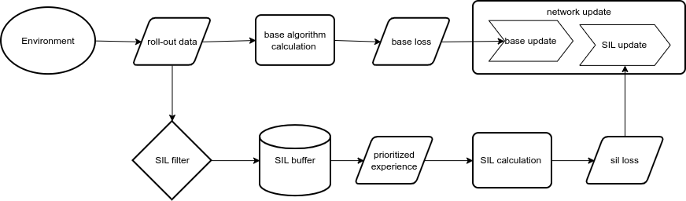
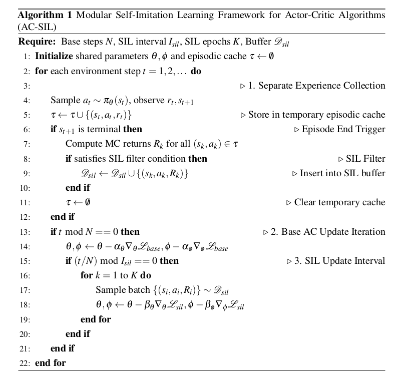
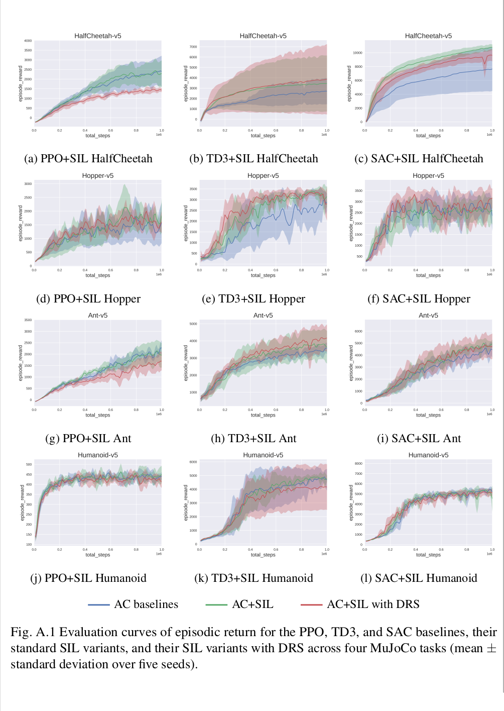
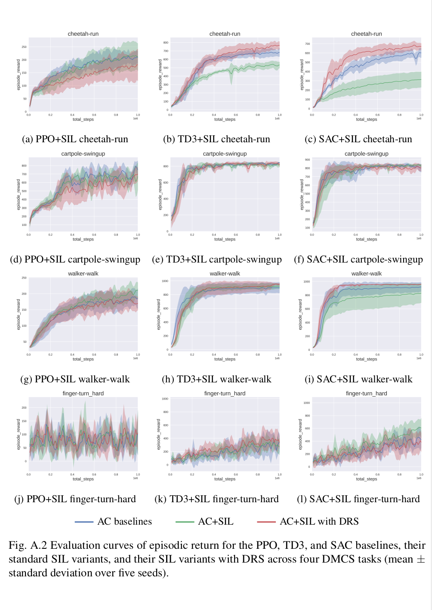

# SIL

This project is a platform-level integration of Self-Imitation Learning (SIL) ([original paper cited here]) as a configurable, plug-and-play module for PPO, TD3, and SAC within the UoA CARES reinforcement learning platform.

Based on this implementation, several experiments were carried out to study SIL generalisation and enhancement across algorithms and environments, including Dynamic Reward Scaling (DRS) and advantage offset. Several configuration parameters were also tested during the analysis, such as SIL intensity.

This project was completed as part of my Master of Robotics and Automation Engineering research at the University of Auckland.

## Development Platform

The implementation was developed across two UoA CARES repositories:

- **Reinforcement learning platform:**  
  `cares_reinforcement_learning` — `SIL_WIP` branch

- **Customised environments:**  
  `gymnasium_environments` — `SIL_WIP` branch

The customised environment repository was used to support experimental integration with environments including:

- MuJoCo
- DeepMind Control Suite
- Additional Gymnasium-compatible continuous-control environments

The original `SIL_WIP` branches are maintained within the UoA CARES repositories and may not be publicly accessible.

## Project Features

- **Plug-and-play integration within the UoA CARES RL platform:**  
  SIL is implemented as a reusable module that can be enabled for supported Actor–Critic algorithms within the existing platform architecture.

- **Command-line activation and configuration:**  
  SIL can be enabled or disabled directly through the main training command. SIL settings and hyperparameters can also be configured using command-line arguments.

- **Unified SIL interface:**  
  Experience collection, SIL buffer management, filtering, replay sampling, and SIL updates are managed through a shared framework.

- **Algorithm-specific integration adapters:**  
  Dedicated adapters connect SIL to PPO, SAC, and TD3 by handling their different policy representations and critic interfaces.

- **Extensible:**  
  Currently supported algorithms: PPO, TD3, and SAC.  
  The framework can support additional Actor–Critic algorithms in the future.

## SIL Integration Architecture

The following diagram illustrates the platform-level integration of the SIL module with the supported Actor–Critic algorithms.

## SIL Pseudocode

The following pseudocode summarises the modular SIL training process implemented in this project.

## Selected Results

### SIL with DRS

Partial results from the research.

#### SIL with DRS in MuJoCo

#### SIL with DRS in DeepMind Control Suite

## Full Thesis

Full thesis available upon request.
